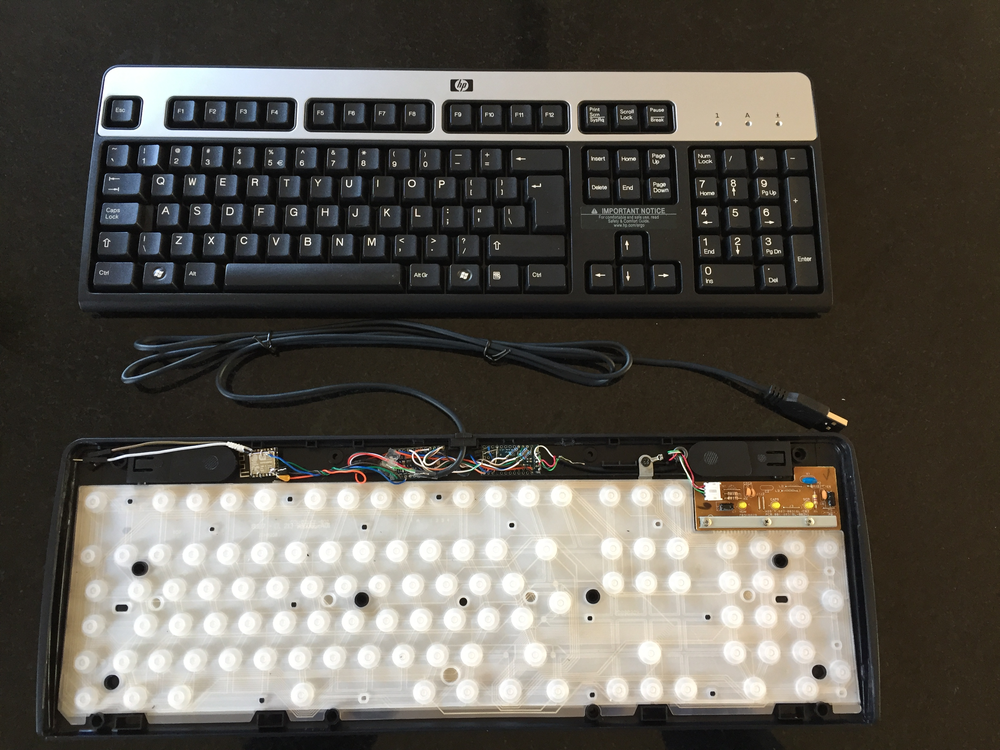

# wifi_ducky_keylogger
Keystroke injection and Keylogger with an ESP8266 + Arduino Pro Micro + USB Host Shield

WARNING:  WORK IN PROGRESS. USE AT YOUR OWN RISK!

The connection between the USB Host Shield and the Arduino Pro Micro over SPI, and is based on this topic:
https://geekhack.org/index.php?topic=80421.0

I had to use a couple of resistors for level-shifting, because I have a 5V Arduino (and the USB Host shield is 3.3V).
Level shifting is required on each signal going from the Arduino Pro Micro to the USB Host Shield:
SCK
MOSI
SS
INT

(Do not connect the 3.3V power connection of the USB Host Shield to the 5V power connection of the Arduino Pro Micro)

Communication between the Arduino Pro Micro and the ESP8266 is over Serial.
This is done by using the Serial connections on the Arduino Pro Micro and SoftwareSerial on the ESP8266.
Arduino TX -> ESP8266 SoftwareSerial RX (gpio14)
Arduino RX <- ESP8266 SoftwareSErial TX (gpio12)
This also should require levelshifting (at least from Arduino 5V to ESP8266 3.3V), but I discovered that my ESP8266 can resist the 5V output from the Arduino Pro Micro. This is not a warranty for each and every ESP8266, so you can better use resistors for levelshifting!

I intentionally did not use the ESP8266's serial pins.
While the code allows for uploading a new image over the web interface, I decided to keep the serial lines available for any manual upload over serial. Just in case of any wifi/config issue.  (also make sure that the ESP8266 can be put into programming mode again)

The cable that (normally) exits the USB keyboard has been cut inside the keyboard.
This allows the keyboard-side of the cable to be connected to the USB connection on the USB Host Shield, and the pc-side of the cable to the USB connection on the Arduino Pro Micro.

Since I had very little space inside the keyboard (and I wanted to keep things as cheap as possible), I decided not to use USB connectors to connect the cables to the USB Host Shield or to the Arduino Pro Micro.
Instead, I removed the female connectors from the PCB's and soldered the wires from the cables directly to the PCB's.

All components have to be powered with either 5V or 3.3V.
For 5V, the 5V wire on the pc cable can be used, as long as the pc USB connector can provide enough power.
This same USB 5V is then also lowered to 3.3V for the ESP8266 and the USB Host Shield.

And finally, don't forget the common ground for everything.

